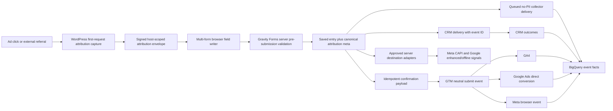

# CEFA Conversion Tracking Remediation Blueprint

Last updated: 2026-07-09

Status: Proposed execution blueprint. No live change is authorized merely by this document.

Assessment source: [Full conversion tracking assessment](./full-conversion-tracking-assessment-and-execution-plan-2026-07-09.md)

Strategic roadmap anchor: [BigQuery marketing intelligence blueprint](../superpowers/plans/2026-06-12-bq-marketing-intelligence-blueprint.md)

## 1. Owner Decisions Applied

This blueprint applies the following decisions:

1. Consent/CMP work is deferred and excluded from the implementation scope below.
2. The in-house Franchise USA Meta marker remains required because the in-house custom conversion filters on `cefa_agency_test=fr_us_in_house`.
3. A partner marker is not required in the current operating model.
4. The partner/Reshift campaign remains on the existing broad `USA Franchise Lead` custom conversion and is separated by campaign/ad-set attribution.
5. The unused partner-only custom conversion remains available but is not selected for optimization.
6. A fresh, exactly recognized non-in-house paid campaign landing must clear a stale in-house marker without setting a partner marker.
7. Existing working conversion actions and event names are preserved unless a task below explicitly changes their configuration.
8. The three regional parent PMax campaigns remain on their current inquiry-only campaign goals. Their budgets, targeting, status, URLs, assets, and copy are outside this plan.

### Why the partner marker is not required

Meta can attribute the broad USA inquiry conversion to the campaign and ad set that produced the lead. The comparison can therefore use:

- in-house campaign: `CEFA | Franchise USA | In-House Lead`, filtered by the in-house marker;
- partner campaign: `USA Franchise Lead`, filtered in reporting by the partner campaign/ad-set ID.

This is asymmetric but valid. The important reporting rule is that partner results must always be filtered to the partner campaign/ad-set ID. Account-wide `USA Franchise Lead` totals include other USA inquiry leads and are not the partner result by themselves.

A partner marker becomes necessary only if CEFA later wants a partner-only custom-conversion row that remains isolated even when campaign attribution is removed from the report.

One protection is still required: the current in-house value persists in a first-party cookie. If a visitor later arrives through a recognized partner campaign, the site must expire the stale in-house cookie. This clearing rule identifies the partner click only to clear in-house state; it does not set `fr_us_partner` and does not change the partner conversion.

## 2. Business Outcome

Enable CEFA marketing and operations teams to follow every confirmed website submission from the original acquisition touch through Gravity Forms, analytics destinations, CRM, and downstream outcome so that campaign optimization and reporting use reconciled lead truth rather than disconnected platform counts.

## 3. Scope

### Included systems

| Layer | Systems |
|---|---|
| Websites | `cefa.ca`, `franchise.cefa.ca`, `franchisecefa.com` |
| Forms | Parent Form 4; Franchise Canada Forms 1 and 2; Franchise USA Forms 1 and 2 |
| Website runtime | CEFA Conversion Tracking plugin, franchise WPCode bridge, GAConnector shadow fields |
| Tag management | Parent, Franchise Canada, and Franchise USA GTM containers |
| Analytics | Three GA4 properties and native BigQuery exports |
| Paid media | Parent and franchise Google Ads accounts; parent and franchise Meta ad accounts |
| Collection | WordPress event sender and Cloud Run collector |
| Business systems | GreenRope/KinderTales and Synuma/SiteZeus delivery paths |
| Warehouse | Gravity Forms, collector, GA4, paid media, CRM, reconciliation, and dashboard serving layers |
| Engineering | GitHub source control, automated tests, deployment evidence, and monitoring |

### Excluded from this blueprint

- Consent/CMP implementation.
- New campaign creative, targeting, budgets, or bidding changes, except conversion-goal corrections explicitly listed below.
- A partner Meta marker or migration to the unused partner-only custom conversion.
- A new event name for each agency, campaign, province, state, or school.
- Immediate removal of GAConnector or the franchise WPCode bridge.
- Immediate promotion of qualified, tour, application, or enrollment events to primary bidding goals.
- Historical rewriting of already reported platform conversions.

## 4. Success Measures

| Measure | Launch target | Steady-state target |
|---|---:|---:|
| Saved entries with a valid server event ID | 100% | 100% |
| Duplicate server event IDs | 0 | 0 |
| Paid entries with UTM or click-ID evidence | >= 98% | >= 98% |
| Internal CEFA referrals classified as acquisition | 0 | 0 |
| Collector coverage after retry window | >= 99.5% | >= 99.9% |
| Browser/server Meta dedup on controlled tests | 100% | >= 99% |
| CRM records containing `cefa_event_id` after cutover | >= 95% | >= 99% |
| Form-to-CRM deterministic match rate | >= 95% | >= 99% |
| In-house marker false positives outside in-house traffic | 0 | 0 |
| Recognized partner landings that clear a stale in-house marker | 100% | 100% |
| Partner results reportable by campaign ID and broad conversion | 100% | 100% |
| PII found in dataLayer or unrestricted event tables | 0 | 0 |
| GA4 reconciliation model incorrectly reporting zero leads | 0 days | 0 days |
| Critical tracking releases with automated test evidence | 100% | 100% |

## 5. Target Architecture



### Source-of-truth order

1. A saved Gravity Forms entry is the confirmed website submission truth.
2. `event_id` is the immutable submission identity.
3. CRM is the lifecycle and revenue outcome truth.
4. Collector and GA4 are delivery/analytics evidence.
5. Google Ads and Meta are platform attribution and optimization evidence.
6. Dashboard metrics must state which layer they represent.

## 6. Dependency And Release Order

```text
Production baseline
  -> urgent destination repairs
  -> Attribution Bridge core and tests
  -> parent shadow rollout
  -> franchise Canada shadow rollout
  -> franchise USA shadow rollout
  -> CRM event-ID handoff
  -> warehouse reconciliation
  -> server destination hardening
  -> one-site-at-a-time legacy retirement
```

Do not combine the following in one release:

- campaign goal changes and website event changes;
- UTM changes and attribution algorithm cutover;
- GAConnector removal and new CRM field activation;
- direct conversion repair and enhanced-conversion activation;
- collector schema expansion and dashboard metric promotion.

## 7. Workstream A: Establish A Reproducible Production Baseline

Priority: P0

Estimated effort: 1-2 working days

### A1. Separate and commit production source

Actions:

1. Inventory the existing dirty working tree and identify which files represent deployed plugin `0.4.5` production behavior.
2. Create a clean branch or worktree from `origin/main`.
3. Bring in only the reviewed production plugin files, collector files, and canonical documentation.
4. Exclude unrelated warehouse drafts and private exports.
5. Run PHP lint, PHPCS, JavaScript syntax, Python compilation, and secret scanning.
6. Commit the production baseline before feature development begins.
7. Tag the baseline with a release label that maps to the deployed WordPress version.

Deliverables:

- one reviewed production-state commit;
- one release manifest containing plugin version, file hashes, GTM versions, form schema versions, and collector image version;
- no secrets or raw live exports.

Acceptance:

- public plugin JavaScript hash matches the committed asset;
- every required PHP file exists in GitHub;
- CI passes from a clean checkout.

Rollback:

- no live rollback is required because this task changes source control only.

### A2. Export live configuration evidence

Actions:

1. Restore read access for the service account to the parent GTM account/container.
2. Export redacted snapshots of parent current GTM, Franchise Canada Version 54, and Franchise USA Version 22.
3. Export all five live Gravity Forms schemas, confirmations, feeds, and hidden-field maps.
4. Export GA4 key-event definitions and custom dimensions.
5. Export Google Ads conversion actions, custom goals, campaign goal settings, tracking templates, and final URL suffixes.
6. Export Meta datasets, custom-conversion rules, promoted objects, and active URL tags.
7. Save identifiers and non-secret configuration in a dated evidence manifest.

Acceptance:

- a reviewer can reproduce the audit inventory without opening the live UI;
- secrets, access tokens, user PII, and raw lead content are absent.

## 8. Workstream B: Repair Immediate Destination And Reporting Gaps

Priority: P0-P1

Estimated effort: 3-5 working days plus platform processing time

### B1. Repair Franchise USA Google Ads final inquiry conversion

Current object:

- campaign: `23533022812`;
- existing primary action: `7482298930` / `Application Submit (USA)`;
- destination: `AW-11088792613/fnFOCLKk6-8bEKWYxqcp`;
- required website helper event: `cefa_franchise_us_inquiry_dispatch`;
- current matching USA GTM tag is paused.

Implementation:

1. Do not create a new conversion action.
2. In a new USA GTM workspace, create a clearly named conversion tag pointing to the existing ID/label.
3. Trigger only on `cefa_franchise_us_inquiry_dispatch` and require:
   - `form_id = 1`;
   - `site_context = franchise_us`;
   - valid `event_id`;
   - confirmed saved-entry payload.
4. Pass `event_id` as transaction ID.
5. Preserve the existing conversion value/currency contract unless a separate value decision is approved.
6. Leave enhanced conversions disabled in this repair release.
7. Preview with GTM debug mode and a synthetic dataLayer event that sends no platform request.
8. Run one approved real Form 1 submission.
9. Confirm exactly one network request reaches the exact conversion label.
10. Confirm the conversion action records activity after platform processing.
11. Confirm Form 2 does not trigger the action.
12. Publish only the reviewed tag/trigger changes.

Acceptance:

- one Form 1 submission creates one direct Google Ads conversion request;
- transaction ID equals the saved server event ID;
- Form 2 and page views create zero requests;
- campaign goal remains the existing USA submit custom goal;
- no budget, bidding, targeting, status, URL, or creative changes.

Rollback:

- restore the prior GTM version;
- do not remove or recreate the Google Ads action;
- document the test event ID and exclusion status if a QA conversion needs annotation.

### B2. Diagnose USA Meta browser Lead bursts

The audit observed browser counts far above server and GA4 counts. This is an investigation task, not an assumption that CAPI dedup is broken.

Actions:

1. In Meta Events Manager, export or record diagnostics by event source, integration, URL, browser/server channel, and hour.
2. Inspect the burst hours and identify whether their event source is GTM, direct Pixel code, a WordPress integration, test traffic, or reporting artifact.
3. Search live HTML, WordPress plugins/snippets, and all GTM versions for dataset `1531247935333023` and `fbq('track', 'Lead')`.
4. Confirm browser and server versions of one controlled inquiry share:
   - event name `Lead`;
   - identical `event_id`;
   - identical inquiry thank-you URL context;
   - matching `cefa_agency_test` only for in-house traffic.
5. Confirm Form 2 remains distinguishable and does not satisfy the USA inquiry custom-conversion URL rule.
6. If a duplicate browser source is proven, pause only that source in a reversible GTM/WordPress release.
7. Monitor hourly browser/server counts for 72 hours after remediation.

Acceptance:

- the source of the bursts is identified or formally classified as a Meta reporting artifact with evidence;
- controlled browser/server events deduplicate;
- no working CAPI or in-house custom-conversion path is removed.

Rollback:

- restore the prior GTM version or re-enable only the proven source;
- preserve diagnostic exports and test event IDs.

Execution result, 2026-07-09:

- Completed without a live tag change.
- Unfiltered `aggregation=event` returned `1,086` apparent Lead counts and the large bursts.
- Correct `aggregation=event_source&event=Lead` with full pagination returned `7` browser and `6` server Lead events.
- The burst finding was an API aggregation/query-semantics artifact, not proven production duplication.
- Working browser/CAPI tags remain active; future monitoring must use explicit event filtering.

### B3. Lock the Meta agency reporting contract

Actions:

1. Keep both in-house ad sets on custom conversion `36521415357505819`.
2. Keep the partner/Reshift ad set on broad conversion `1915200622465036`.
3. Do not add a partner marker.
4. Do not switch the partner ad set to custom conversion `1352507926817889`.
5. Verify all in-house active ads still resolve `cefa_agency_test=fr_us_in_house` through explicit URL tags or the exact campaign-ID/slug fallback.
6. Verify partner ads do not resolve the in-house marker.
7. Capture the exact current partner campaign ID and governed slug from the live read-only snapshot.
8. Add a clearing-only rule: a fresh paid-social landing from that exact partner campaign expires any existing `cefa_agency_test=fr_us_in_house` cookie and stores no partner value.
9. Set the in-house marker lifetime to the current ad-set click attribution window, with an explicit maximum of seven days unless paid media approves a different window.
10. Test four journeys:
   - in-house click -> inquiry: in-house and broad conversions qualify;
   - partner click -> inquiry: broad conversion qualifies and in-house does not;
   - in-house click -> partner click -> inquiry: stale in-house state is cleared and only the broad rule qualifies;
   - in-house click -> direct return within the approved window -> inquiry: in-house state remains available.
11. Build the agency comparison report using:
   - campaign ID and campaign name;
   - ad-set ID and ad-set name;
   - in-house filtered conversion for in-house rows;
   - broad USA inquiry conversion filtered to partner campaign ID for partner rows;
   - spend, impressions, clicks, landing-page views, inquiry conversions, cost per inquiry, qualified leads, and downstream outcomes.
12. Use Meta Experiments or mutually exclusive audiences when available to reduce cross-campaign competition.

Acceptance:

- a real in-house inquiry fires the in-house conversion and the broad USA conversion;
- it is attributed to the in-house campaign when reached through a served in-house ad;
- a recognized partner landing clears stale in-house state without setting a partner marker;
- partner reporting uses only partner campaign/ad-set rows;
- no partner marker is required or inferred.

Rollback:

- retain the current in-house GTM fallback and current promoted objects;
- report both campaigns on the broad conversion temporarily if low volume makes split optimization unstable.

### B4. Clean GA4 key-event definitions

Actions:

1. Snapshot all current key events and linked Google Ads imports.
2. Keep confirmed final submit events as key events.
3. Keep micro events in GA4 as ordinary events for funnel diagnostics.
4. Remove key-event status from parent `find_a_school_click`, `email_click`, and `phone_click` after confirming no dashboard or Ads goal relies on them as final leads.
5. Review parent `inquiry_click` and `purchase` before changing them. Do not remove a legitimate commerce event blindly.
6. Remove key-event status from franchise click actions such as `fr_email_click`, `fr_phone_click`, and application-click events when they are not completed forms.
7. Review stale USA key-event definitions and retain only active business events.
8. Keep direct Google Ads final-submit actions primary; keep duplicate GA4 imports secondary.
9. Update Looker definitions so `website_lead` means a confirmed submit, not a sum of key events.

Acceptance:

- the GA4 key-event inventory has an owner and business definition;
- ordinary click events remain queryable;
- Google Ads campaign bidding does not lose its approved direct submit action;
- lead dashboards no longer combine clicks and submissions.

Rollback:

- restore key-event status from the snapshot if a verified dependency was missed;
- do not change event collection code during this task.

Execution result, 2026-07-09:

- Removed key-event status from four parent click events and three Franchise Canada click events.
- Kept `generate_lead` and GA4's non-deletable `purchase` key event.
- Left Franchise USA key events unchanged pending lifecycle review.
- Click-event collection remains active as ordinary analytics events.

### B5. Isolate two parent Search campaign goals

Campaigns:

- `14995905347` / branded Search;
- `23854771600` / Oakville Eighth Line Search.

Actions:

1. Read back each campaign's current bidding strategy and campaign goal settings.
2. Confirm both campaigns are intended to optimize for parent inquiries.
3. Use Google Ads API `validateOnly=true` for the proposed campaign-goal operations.
4. Configure an explicit campaign-level inquiry goal equivalent to the working regional PMax lead goal.
5. Make only `SUBMIT_LEAD_FORM / WEBSITE` biddable for these campaigns.
6. Leave calls, directions, YouTube engagement, app actions, and micro actions in observation only unless paid media explicitly approves otherwise.
7. Do not change budget, bidding strategy, ads, keywords, locations, or status in the same operation.
8. Read back the goal settings after apply.

Acceptance:

- each campaign has an explicit inquiry-only biddable goal;
- regional PMax settings remain unchanged;
- no campaign status or spend control changes.

Rollback:

- restore the captured customer-goal inheritance settings with a separately validated operation.

Execution result, 2026-07-09:

- All 12 proposed campaign-goal operations passed Google Ads API `validateOnly=true`.
- Both Search campaigns now have only `SUBMIT_LEAD_FORM / WEBSITE` biddable.
- All unrelated goal families are non-biddable for those campaigns.
- Read-back confirmed the three regional PMax campaigns remain inquiry-only and otherwise unchanged.

### B6. Standardize Google Ads URL parameters

Target contract:

```text
utm_source=google&utm_medium=cpc&utm_campaign={campaignid}&utm_id={campaignid}&utm_content={creative}&utm_term={keyword}&google_adgroup_id={adgroupid}&google_network={network}&google_device={device}&google_matchtype={matchtype}
```

Actions:

1. Inventory effective account, campaign, ad-group, and ad tracking templates/suffixes.
2. Choose one owner: the account-level final URL suffix.
3. Keep auto-tagging enabled.
4. Remove duplicate UTM keys from lower-level suffixes only after effective-URL preview proves the account suffix applies.
5. Clear the old tracking template or reduce it to the minimum non-duplicating form after preview validation.
6. Preserve final landing URLs and all campaign-specific page paths.
7. Test Search, PMax, mobile, desktop, and a URL that already contains a query string.
8. Confirm only one value exists for each UTM key.
9. Confirm `gclid`, `gbraid`, or `wbraid` reaches the website unchanged.
10. Confirm the attribution bridge saves campaign ID even when keyword/ad-group values are blank for PMax.

Acceptance:

- one effective UTM value per key;
- no redirect loops or malformed `?`/`&` separators;
- no final URL changes;
- auto-tagging remains enabled.

Rollback:

- restore the exported account template and lower-level suffixes;
- roll out one account at a time, starting with a low-risk campaign subset.

Pilot result, 2026-07-09:

- The parent account remains auto-tagged and retains its legacy account tracking template during the pilot.
- Campaign `14995905347` / branded Search was selected because it has one enabled ad, no lower-level URL options, and one homepage final URL.
- Google Ads API `validateOnly=true` passed before apply.
- The campaign now overrides the inherited template with `{lpurl}` and owns the canonical final URL suffix shown above.
- Read-back confirmed no change to campaign status, budget, bidding, ad group, ad state, or final URL.
- Live synthetic rendering returned HTTP `200`, zero redirects, correct existing-query separators, and preserved `gclid`, `gbraid`, and `wbraid` independently.
- No PMax, school Search campaign, account-level URL option, or ad-level suffix changed.
- Account-wide rollout is gated on the Attribution Bridge shadow test and a complete lower-level suffix cleanup map.

### B7. Inventory and quarantine legacy conversion objects

Actions:

1. Create dependency maps for every GA4 key event, Google Ads conversion action/custom goal, Meta custom conversion, GTM tag, and dashboard metric.
2. Label each object `active-primary`, `active-secondary`, `reporting-only`, `legacy-dependent`, or `archive-candidate`.
3. Do not archive an object referenced by an active campaign, dashboard, automated rule, or connector.
4. Archive in small batches after 30 days with no dependency and no activity.
5. Preserve dated exports and rollback notes.

Acceptance:

- no active campaign references an archive candidate;
- naming clearly distinguishes parent, franchise Canada, franchise USA, form type, and destination.

## 9. Workstream C: Build CEFA Attribution Bridge V1

Priority: P1

Estimated development effort: 2-3 weeks

### C1. Feature flags

Add runtime modes so the bridge can be deployed without immediate cutover:

| Flag | Values | Purpose |
|---|---|---|
| `CEFA_CT_ATTRIBUTION_V2_MODE` | `off`, `shadow`, `primary` | Controls attribution capture/write behavior |
| `CEFA_CT_PAYLOAD_V2_ENABLED` | boolean | Controls idempotent confirmation payloads |
| `CEFA_CT_COLLECTOR_QUEUE_ENABLED` | boolean | Controls queued collector delivery |
| `CEFA_CT_CRM_IDENTITY_ENABLED` | boolean | Controls new CRM identity fields after mapping approval |

Rules:

- `shadow` writes canonical entry meta but does not overwrite legacy hidden fields used by production feeds;
- `primary` writes approved V2 hidden fields and legacy compatibility fields;
- feature flags are hostname scoped;
- production defaults remain `off` until the applicable release gate passes.

Foundation result, 2026-07-09:

- The hostname-scoped mode parser and server-only secret contract are implemented in the remediation PR.
- Unknown modes fail closed to `off`; the production default remains `off`.
- No plugin release or WordPress deployment has been made.

### C2. File-level implementation plan

Modify:

- `cefa-conversion-tracking.php` to load V2 classes and bump the plugin version only at release time;
- `includes/class-cefa-conversion-tracking.php` to register request capture, per-form hooks, and queued delivery;
- `includes/class-cefa-conversion-tracking-config.php` to expose complete per-form browser contracts instead of one primary `formId`;
- `includes/class-cefa-conversion-tracking-attribution.php` to use canonical envelopes and explicit field maps;
- `includes/class-cefa-conversion-tracking-event-id.php` to separate browser attempt ID from server event ID;
- `includes/class-cefa-conversion-tracking-confirmation-payload.php` to store one final payload per saved entry;
- `includes/class-cefa-conversion-tracking-duplicate-guard.php` to make reads idempotent during TTL;
- `includes/class-cefa-conversion-tracking-datalayer-payload.php` to build from canonical saved attribution;
- `includes/class-cefa-conversion-tracking-collector.php` to enqueue generic form events;
- `assets/js/cefa-conversion-tracking.js` to support multiple forms and V2 attribution.

Add focused classes only where they remove real complexity:

- `includes/class-cefa-conversion-tracking-attribution-envelope.php`;
- `includes/class-cefa-conversion-tracking-entry-attribution.php`;
- `includes/class-cefa-conversion-tracking-delivery-queue.php`.

Add tests under:

- `tests/php/`;
- `tests/js/`;
- `tests/python/`;
- `tests/contracts/` for redacted form and payload fixtures.

### C3. Server request capture

Run early on public front-end requests for supported hostnames.

Algorithm:

1. Normalize the hostname and select the site context.
2. Parse only allowlisted acquisition parameters.
3. Parse external referrer host/path without retaining arbitrary query strings.
4. Reject own-site and approved cross-domain CEFA referrers before source inference.
5. Build a meaningful acquisition touch only when at least one of these exists:
   - paid click ID;
   - explicit UTM/source parameter;
   - approved external referrer.
6. Do not add an internal page view or ordinary direct navigation to touch history.
7. Preserve first touch once established.
8. Update last non-direct touch only from a new meaningful non-direct touch.
9. Update current touch for the current request without erasing last non-direct attribution.
10. Set a 90-day expiry and cap history at eight meaningful touches.
11. Sign the serialized envelope with HMAC using a server-only secret.
12. Store it in a host-scoped `Secure`, `SameSite=Lax`, path `/` cookie.

Host namespaces:

| Site | Cookie namespace |
|---|---|
| Parent | `cefa_parent_attr_v1` |
| Franchise Canada | `cefa_fr_ca_attr_v1` |
| Franchise USA | `cefa_fr_us_attr_v1` |

Do not share a broad `.cefa.ca` attribution cookie between parent and Franchise Canada. Cross-property transfer, if later required, must be an explicit signed handoff.

### C4. Allowlisted capture contract

Approved query keys:

- `utm_source`, `utm_medium`, `utm_campaign`, `utm_id`, `utm_term`, `utm_content`;
- `gclid`, `gbraid`, `wbraid`, `fbclid`, `msclkid`;
- `google_adgroup_id`, `google_network`, `google_device`, `google_matchtype`;
- `meta_campaign_id`, `meta_adset_id`, `meta_ad_id`;
- `cefa_agency_test` for approved in-house values only.

Rules:

- do not save arbitrary query parameters;
- do not save names, email, phone, addresses, free text, or form values in URLs;
- save landing and referrer as normalized scheme/host/path fields;
- normalize source and medium to lowercase governed values;
- preserve campaign/content case only if reporting requires it;
- cap every value according to the canonical schema;
- reject control characters and placeholder values.

### C5. Source classification contract

Use exact host and registrable-domain maps, not substring matching.

Precedence:

1. Google click IDs -> `google / cpc`.
2. Microsoft click ID -> `bing / cpc` unless explicit approved source overrides the display name.
3. Meta click ID -> explicit Meta source or `facebook / paid_social`.
4. Explicit governed UTM source/medium.
5. External search referrer -> `<engine> / organic`.
6. External social referrer -> `<network> / referral` unless paid evidence exists.
7. Other external referrer -> `<registrable-domain> / referral`.
8. No acquisition evidence -> `direct / none`, but do not overwrite last non-direct.

Exact own-site exclusions:

- `cefa.ca` and approved parent subdomains;
- `franchise.cefa.ca` and its approved staging hostname;
- `franchisecefa.com` and its approved staging hostname;
- payment/form/service domains only when explicitly documented as same-journey infrastructure.

Add test fixtures for Google, Bing, Meta, Instagram, GBP, Yelp, organic search, AI referrals, email, direct, internal CEFA navigation, and malformed URLs.

### C6. Signed attribution envelope

Canonical shape:

```json
{
  "schema_version": "1.0",
  "site_context": "parent",
  "captured_at": "2026-07-09T00:00:00Z",
  "expires_at": "2026-10-07T00:00:00Z",
  "first_touch": {},
  "last_non_direct_touch": {},
  "current_touch": {},
  "click_ids": {},
  "platform_ids": {},
  "experiment": {},
  "touch_count": 1,
  "touch_history": []
}
```

Each touch may contain only:

- source, medium, campaign, campaign ID, content, term, channel;
- landing host/path;
- referrer host/path;
- touch timestamp;
- click-ID type, not raw click ID duplicated in history.

Raw click IDs belong in the top-level restricted `click_ids` object and approved form fields. The signed value must be rejected if its signature, site context, schema, or expiry is invalid.

Foundation result, 2026-07-09:

- The canonical envelope capture/sign/verify class is implemented in source control.
- Focused tests cover Google paid capture, allowlist enforcement, path-only landing storage, HMAC round trip, tamper rejection, cross-context rejection, expiry rejection, internal/direct preservation, Google click-ID family replacement, and the approved in-house marker.
- CI now runs the envelope contract test on PHP `7.4` and `8.2` in addition to syntax and WordPress coding standards.
- Entry-meta persistence, browser envelope exposure, hidden-field adapters, and production shadow activation remain gated work.

### C7. Browser multi-form writer

Replace the single global `formId` assumption with a contract map keyed by form ID.

Required behavior:

1. Discover supported `form#gform_<id>` elements.
2. Resolve selectors from the form's contract, not parent Form 4 constants.
3. Run after initial render, `gform_post_render`, Gravity Forms V2 render events, AJAX re-render, and immediately before submit.
4. Populate only approved tracking fields.
5. Never overwrite business fields, location routing, School Manager metadata, or user-entered values.
6. Populate missing values from the verified server envelope first.
7. Add browser-only values when available:
   - GA client ID;
   - GA session ID;
   - `_fbp` and `_fbc`;
   - browser `submission_attempt_id`.
8. Keep the in-house marker precedence:
   - explicit current URL marker;
   - exact current in-house campaign ID/slug fallback;
   - unexpired signed/persisted in-house value;
   - blank.
9. Before applying stored in-house state, clear it when the current landing contains exact allowlisted non-in-house paid campaign evidence.
10. The clearing rule stores no partner marker and cannot be triggered by a city, state, broad USA URL, or loose text match.
11. Remove parent/Form 4 names from generic storage keys.

### C8. Hidden-field and entry-meta contract

Do not invent numeric Gravity Forms field IDs in code or documentation. Export each form, add fields in staging, and record approved IDs in a versioned map.

Required hidden-field semantic keys:

| Family | Keys |
|---|---|
| Identity | `cefa_event_id`, `cefa_submission_attempt_id`, `cefa_attr_schema_version` |
| First touch | `cefa_first_source`, `cefa_first_medium`, `cefa_first_campaign`, `cefa_first_campaign_id`, `cefa_first_landing`, `cefa_first_referrer`, `cefa_first_touch_at` |
| Last non-direct | `cefa_last_source`, `cefa_last_medium`, `cefa_last_campaign`, `cefa_last_campaign_id`, `cefa_last_content`, `cefa_last_term`, `cefa_last_landing`, `cefa_last_touch_at` |
| Click IDs | `cefa_gclid`, `cefa_gbraid`, `cefa_wbraid`, `cefa_fbclid`, `cefa_msclkid` |
| Platform IDs | `cefa_google_adgroup_id`, `cefa_meta_campaign_id`, `cefa_meta_adset_id`, `cefa_meta_ad_id` |
| Browser IDs | `cefa_ga_client_id`, `cefa_ga_session_id`, `cefa_fbp`, `cefa_fbc` |
| Experiment | `cefa_agency_test`, `cefa_agency_resolution_source` |

Canonical entry meta:

- `cefa_conversion_tracking_event_id`;
- `cefa_conversion_tracking_attribution_v1` containing bounded normalized JSON;
- `cefa_conversion_tracking_schema_version`;
- `cefa_conversion_tracking_delivery_status`;
- `cefa_crm_record_id` and destination-specific IDs when available.

Legacy compatibility:

- Parent fields 35-46 remain populated during shadow/cutover.
- Franchise fields 14-30 remain populated during shadow/cutover.
- Legacy fields are adapters, not the new source of truth.
- Remove them only after CRM feeds, warehouse loads, and rollback windows no longer depend on them.

### C9. Server pre-submission rules

For each supported `gform_pre_submission_<form_id>` hook:

1. Verify the signed attribution envelope.
2. Sanitize posted tracking fields by semantic contract.
3. Reject or blank values outside their allowed type/length.
4. Use current-request click IDs before older stored click IDs.
5. Keep only the current Google click-ID family member when a newer Google click ID arrives.
6. Fill blank approved hidden fields from the verified envelope.
7. Generate a new server `event_id` for the submission.
8. Treat the browser ID only as `submission_attempt_id`.
9. Save the canonical attribution meta after Gravity Forms creates the entry.
10. Record provenance for each field as `request`, `signed_envelope`, `browser_cookie`, `legacy_cookie`, or `blank` in entry meta, not as dozens of extra form fields.

### C10. Event-ID uniqueness

Implementation decision:

1. Stop accepting a browser event ID as final submission identity.
2. Generate the final UUID on the server for every successfully saved entry.
3. Reserve the ID in a small plugin-owned table with a unique primary key before destination dispatch.
4. Store site context, form ID, entry ID, event ID, and created timestamp only.
5. Retry UUID generation if the unique insert fails.
6. Keep the browser attempt ID separately for validation/double-click diagnostics.
7. Do not rewrite historical platform event IDs.
8. In the warehouse, flag historical duplicate IDs and use a derived historical row key without pretending those IDs were unique.

Acceptance:

- 10,000 generated test IDs produce no duplicates;
- a double click that creates one entry produces one event ID;
- two separately saved entries never share an event ID;
- all destination payloads for one entry use the same final event ID.

### C11. Idempotent confirmation payload

Replace delete-on-GET behavior:

1. Store one final no-PII payload per saved event ID for 30 minutes.
2. Issue an unguessable signed token containing event ID and expiry.
3. Let the endpoint return the same payload more than once during its TTL.
4. Do not delete the payload on GET.
5. Use browser sessionStorage plus destination transaction/event IDs for deduplication.
6. Return `Cache-Control: no-store`.
7. Reject invalid signatures, expired tokens, wrong host context, and unsupported schema versions.
8. Log status code and event ID hash only, never payload contents.

Acceptance:

- browser prefetch followed by the real page still retrieves the payload;
- repeated retrieval does not create duplicate dataLayer events in one browser;
- repeated platform sends deduplicate by event/transaction ID.

## 10. Workstream D: Form-Specific Rollout

### D1. Parent Form 4

Changes:

1. Add V2 hidden fields in a cloned/staging form revision.
2. Preserve School Manager compound field 32 and fields 35-46.
3. Correct internal-referrer classification.
4. Make server entry meta the rich attribution truth.
5. Continue emitting `school_inquiry_submit` only after saved entry confirmation.
6. Preserve final URLs, routing, KinderTales/GreenRope delivery, and current GTM mappings.

Shadow acceptance:

- >= 98% parity for paid source/medium/campaign/click IDs;
- first and last non-direct values explain every mismatch category;
- zero routing or business-delivery regressions;
- 100% unique event IDs.

### D2. Franchise Canada Forms 1 and 2

Changes:

1. Deploy the main plugin in shadow mode while keeping the live WPCode bridge and GAConnector fields operational.
2. Verify both forms are handled by the multi-form runtime.
3. Preserve neutral events:
   - Form 1 `franchise_inquiry_submit`;
   - Form 2 `real_estate_site_submit`.
4. Preserve GTM Version 54 destination continuity.
5. Populate fields 14-30 for compatibility while saving canonical V2 meta.
6. Ensure current `gclid` overrides stale GAConnector `gclid`.
7. Do not change Synuma/SiteZeus routing during shadow mode.

### D3. Franchise USA Forms 1 and 2

Changes:

1. Deploy after the USA Google Ads and Meta diagnostics are stable.
2. Keep GTM Version 22 behavior until V2 is proven.
3. Preserve the in-house marker and exact fallback.
4. Do not add or infer a partner marker.
5. Clear stale in-house state on an exactly recognized partner paid landing without storing a partner value.
6. Preserve homepage-first persistence for the in-house campaign.
7. Keep Form 1 inquiry and Form 2 site submission isolated.
8. Confirm the repaired Google Ads action fires only for Form 1.

### D4. Shadow comparison report

For every entry, compare legacy versus V2:

- source, medium, campaign, campaign ID;
- landing and referrer host/path;
- gclid/gbraid/wbraid/fbclid/msclkid presence;
- GA client ID presence;
- in-house marker value and resolution source;
- event ID uniqueness;
- CRM delivery status.

Mismatch categories:

- expected V2 improvement;
- legacy cookie missing;
- current URL override;
- internal referral corrected;
- stale click ID removed;
- browser storage unavailable;
- invalid/tampered value rejected;
- implementation defect.

Do not cut over while unresolved implementation defects exceed 2% of paid entries.

## 11. Workstream E: Collector Reliability And Expansion

Priority: P1

### E1. Queued delivery

Preferred implementation:

1. Confirm whether Action Scheduler is already installed and supported on all three sites.
2. If available, use a namespaced Action Scheduler job.
3. If unavailable, bundle a reviewed version or implement a plugin-owned queue with WP-Cron and a unique event-ID key.
4. Never make the visitor wait for the collector response.
5. Worker requests may block for up to five seconds because they run outside the form response.
6. Retry on timeout, connection errors, HTTP 429, and HTTP 5xx.
7. Do not retry permanent 4xx schema/signature failures without intervention.
8. Use exponential backoff with jitter, for example 1, 5, 20, 60, and 240 minutes.
9. Record attempts, last status, last error code, and next attempt without storing the payload body in logs.
10. Move exhausted jobs to a dead-letter status visible in WordPress Site Health or an admin-safe monitor.

### E2. Generic collector contract

1. Add a versioned `/collect/form-submit` endpoint while keeping `/collect/form4` during migration.
2. Accept only allowlisted site/form/event combinations.
3. Use `site_context + form_id + event_id` as the idempotency key.
4. Continue HMAC timestamp verification.
5. Generalize the BigQuery schema for parent and franchise forms.
6. Store no raw names, email, phone, address, message, IP, or user agent.
7. Return an explicit accepted/duplicate/permanent-error response.
8. Add structured metrics for accepted, duplicate, rejected, retried, and dead-lettered requests.

### E3. Collector release gates

- signed fixture accepted;
- unsigned fixture rejected;
- replay accepted as duplicate without a second business row;
- unsupported form rejected;
- PII fixture rejected;
- transient BigQuery failure retried;
- sender outage does not block form submission;
- post-retry coverage reaches target before dashboard promotion.

## 12. Workstream F: CRM Identity And Lifecycle Attribution

Priority: P1

Estimated effort: 1-2 weeks plus CRM-owner coordination

### F1. CRM field dictionary

Create approved custom fields in each destination for:

- `cefa_event_id`;
- `cefa_form_entry_id` or a destination-safe external record key;
- site context and form family;
- first source, medium, campaign, and campaign ID;
- last non-direct source, medium, campaign, and campaign ID;
- landing/referrer host/path;
- approved click-ID fields with restricted visibility;
- in-house test ID when present.

Do not transmit touch-history JSON or arbitrary URL query strings to CRM.

### F2. Parent GreenRope/KinderTales handoff

1. Export the active Form 4 feeds/integrations and current field mappings.
2. Identify which destination owns lead creation and which owns enrollment/tour outcomes.
3. Add the event ID and approved attribution fields without changing school routing.
4. Verify a test entry creates one destination record.
5. Capture returned CRM/opportunity/contact ID where the API supports it.
6. Write the returned ID to Gravity Forms entry meta.
7. If the destination cannot return synchronously, add a scheduled reconciliation by event ID.
8. Never use email alone as the durable join key.

### F3. Franchise Synuma/SiteZeus handoff

1. Export active Canada and USA Form 1/2 feeds and field maps.
2. Add event ID, form entry key, form family, market, and approved attribution fields.
3. Confirm Form 1 and Form 2 map to the correct destination object types.
4. Write Synuma/SiteZeus lead IDs back to Gravity Forms entry meta where possible.
5. Hash destination IDs in unrestricted warehouse facts; retain raw IDs only in restricted tables.

### F4. Lifecycle definitions

Define one governed status dictionary before uploads:

| Lifecycle stage | Required source evidence | Initial platform use |
|---|---|---|
| Confirmed inquiry | Saved form entry | Primary website conversion |
| Marketing-qualified lead | CRM rule and timestamp | Secondary/reporting |
| Franchise-qualified lead | CRM rule and timestamp | Secondary/reporting |
| Tour booked/completed | KinderTales/CRM rule | Secondary/reporting |
| Application | CRM/application rule | Secondary/reporting |
| Enrollment/closed outcome | Authoritative operational system | Value reporting, later optimization review |

Every lifecycle event needs:

- immutable lifecycle event ID;
- original website event ID when available;
- stage timestamp;
- source system;
- rule version;
- value/currency only when approved.

## 13. Workstream G: Destination Adapter Hardening

### G1. Neutral website contract

Keep website events neutral:

- `school_inquiry_submit`;
- `franchise_inquiry_submit`;
- `real_estate_site_submit`.

Required common payload:

- event ID;
- form ID/family;
- site context/business unit/market/country;
- lead type/intent;
- approved non-PII business metadata;
- canonical first and last non-direct attribution;
- approved click/platform IDs;
- tracking source and schema version.

Destination event names remain in GTM or server adapters.

### G2. GA4

1. Map confirmed neutral submits to `generate_lead` with low-cardinality context.
2. Keep micro events ordinary.
3. Do not register event ID, raw click IDs, full URLs, or touch history as GA4 custom dimensions.
4. Keep those high-cardinality fields in native BigQuery export and form truth.
5. Use `event_id` as an event parameter for warehouse reconciliation.
6. Do not add a second server `generate_lead` while browser/GTM is the active production event.
7. If a server audit is required, use a clearly secondary audit event until dedup strategy is proven.

### G3. Google Ads direct submit

1. Maintain one primary direct final-submit action per campaign objective.
2. Pass event ID as transaction ID.
3. Keep duplicate GA4 imports secondary.
4. Preserve the three PMax campaign goal overrides.
5. Apply inquiry-only goals to the two identified Search campaigns.
6. Do not use phone/email clicks, directions, app actions, or video engagement as lead-bidding goals.

### G4. Google enhanced conversions for leads

This is a later hardening task and requires separate approval for server-side user-data processing. It does not block the core attribution bridge.

Design:

1. Stop relying on Elementor DOM selectors on thank-you pages.
2. Read normalized lead data from the saved Gravity Forms entry in a protected server worker.
3. Normalize and hash approved identifiers immediately before upload.
4. Send against the existing direct conversion action and original click/conversion context.
5. Keep raw identifiers out of logs and unrestricted BigQuery tables.
6. Store only event ID, action ID, attempt status, response code, and timestamps in the delivery ledger.
7. Launch in diagnostics/reporting mode before using match-rate improvements operationally.

### G5. Meta browser/CAPI

1. Keep browser and server event name, event ID, dataset, and URL context aligned.
2. Preserve `fbc`/`fbp` and current approved match keys.
3. Keep in-house marker only on in-house events.
4. Do not create agency-specific base event names.
5. Keep Form 1 and Form 2 distinguishable.
6. Add a delivery ledger keyed by event ID and destination.
7. Investigate broad raw Lead anomalies before relying on account-wide raw counts.

### G6. Offline/lifecycle uploads

1. Do not upload until CRM event identity reaches the acceptance target.
2. Upload qualified/lifecycle events as secondary first.
3. Use stable event IDs and original click identifiers when valid.
4. Deduplicate lifecycle events by lifecycle event ID.
5. Reconcile two full attribution windows.
6. Promote a lifecycle action to primary only after paid media, CRM, analytics, and business owners approve the definition and volume.

## 14. Workstream H: Warehouse And Reporting Repair

Priority: P1

### H1. Move franchise loader logic into durable source control

Current private loader relies on label regex and misses fields `lc_*` and `fc_*`.

Actions:

1. Create a reviewed loader or transformation in the GitHub-backed conversion-tracking repository.
2. Define explicit field-ID maps by site, form ID, and schema version.
3. Stop discovering first/last source through label regex.
4. Retain label matching only as a monitored fallback for unknown historical forms.
5. Add fixture tests for Canada and USA Forms 1 and 2.

### H2. Franchise submission schema V2

Add:

- site context, form ID, form family, and event name;
- event ID and hashed form entry key;
- first and last non-direct source/medium/campaign/campaign ID;
- landing/referrer host/path;
- click-ID presence booleans and restricted hashes/raw fields as approved;
- GA client ID presence;
- in-house marker and resolution source;
- CRM destination ID presence/hash;
- attribution schema version and capture provenance;
- test-row and load metadata.

Do not break current dashboard columns. Add V2 facts/views, validate them, then promote serving contracts with explicit approval.

### H3. Repair parent GA4 reconciliation

1. Replace the empty/stale GA4 source used by `dashboard_form4_event_reconciliation_daily_latest`.
2. Normalize `analytics_267558140.events_*` into a governed GA4 event fact.
3. Filter helper `generate_lead` by parent property, form ID, tracking source, and valid event ID.
4. Reconcile on event date using the property timezone and document UTC boundary behavior.
5. Count both event rows and distinct event IDs.
6. Flag duplicate event IDs rather than silently deduplicating them.
7. Backfill the validation window without changing business KPI contracts.

Acceptance:

- known GA4 leads no longer show as zero;
- form and GA4 differences are explainable by browser loss/timezone rather than source failure;
- dashboard surface remains advisory until approved.

### H4. Unified event and CRM bridge

Build governed entities:

1. website submission fact keyed by site/form/event ID;
2. collector receipt fact keyed by event ID;
3. GA4 final-event fact keyed by event ID where present;
4. destination delivery ledger keyed by event ID and destination;
5. CRM bridge keyed by event ID and restricted CRM record ID;
6. lifecycle fact keyed by lifecycle event ID and original event ID;
7. daily reconciliation fact with source-specific counts and deltas.

Public marts receive:

- event ID hash where needed;
- click-ID presence booleans or hashes;
- no raw PII;
- no raw unrestricted CRM/contact identifiers.

### H5. Reporting definitions

Publish metric contracts for:

- confirmed website inquiries;
- platform-attributed conversions;
- qualified leads;
- tours/applications/enrollments;
- cost per confirmed inquiry;
- cost per qualified lead;
- agency-test results.

Agency report rule:

- in-house: in-house campaign ID plus in-house custom conversion;
- partner: partner campaign ID plus broad USA inquiry conversion;
- never compare account-wide broad conversion totals directly with in-house filtered totals.

## 15. Workstream I: Automated Tests And CI

Priority: P1

### I1. PHP tests

Add PHPUnit-compatible tests for:

- hostname/context selection;
- field-contract resolution;
- signed envelope validation and expiry;
- exact source/referrer classification;
- strict URL allowlist;
- server event-ID generation and uniqueness reservation;
- hidden-field fill-only behavior;
- click-ID precedence;
- entry-meta serialization;
- idempotent payload retrieval;
- queue retry classification;
- PII rejection.

### I2. JavaScript tests

Use a DOM-capable test runner for:

- Forms 1, 2, and 4 on the same runtime;
- initial render and AJAX re-render;
- validation failure followed by successful submit;
- internal referral suppression;
- direct traffic preserving last non-direct;
- URL and cookie precedence;
- expired attribution cleanup;
- in-house explicit marker and exact campaign fallback;
- partner traffic remaining unmarked;
- in-house click followed by a recognized partner click clearing stale in-house state;
- event/payload dedup in sessionStorage;
- Safari-like storage failures.

### I3. Collector tests

Add Python tests for:

- signature verification;
- timestamp tolerance;
- allowlisted fields;
- PII field rejection;
- URL query stripping;
- multiple supported form contracts;
- insert-ID idempotency;
- duplicate and transient failure responses.

### I4. End-to-end staging tests

For each of five forms:

1. direct submission;
2. UTM-only submission;
3. Google click-ID submission;
4. Meta click-ID and UTM submission;
5. organic/referral submission;
6. validation error then success;
7. double-click protection;
8. redirect confirmation reload;
9. AJAX confirmation where applicable;
10. browser back/reload.

Verify:

- one saved entry;
- one server event ID;
- correct hidden fields and canonical meta;
- one neutral dataLayer event;
- expected GA4/Ads/Meta destinations only;
- collector receipt;
- CRM record and ID handoff;
- warehouse reconciliation.

### I5. CI changes

Extend `.github/workflows/ci.yml` with:

- PHPUnit on supported PHP versions;
- JavaScript unit tests;
- Python unit tests;
- JSON/contract fixture validation;
- secret scan;
- Markdown link check;
- generated package/build diff check if a release bundle is produced.

Require CI and one code review before merging runtime changes.

## 16. Deployment Phases

### Phase 0: Baseline and freeze, week 1

Deliver:

- clean production commit;
- GTM/form/platform snapshots;
- parent GTM read access;
- change register and rollback owners.

Exit gate:

- production is reproducible from source and evidence.

### Phase 1: Immediate repairs, week 1-2

Deliver:

- USA Google Ads final inquiry receipt;
- Meta raw Lead diagnosis;
- locked asymmetric agency reporting contract;
- GA4 key-event cleanup;
- two Search goal overrides;
- Google UTM pilot.

Exit gate:

- every live form reaches only approved final destinations once in controlled QA;
- no campaign budget/status/targeting changes;
- partner reporting works without a partner marker.

### Phase 2: Attribution Bridge build, week 2-4

Deliver:

- server capture and signed envelope;
- multi-form writer;
- canonical hidden/meta fields;
- unique server event IDs;
- idempotent payload;
- automated tests and feature flags.

Exit gate:

- staging tests pass and no business field/routing is changed.

### Phase 3: Shadow rollout, week 5-8

Order:

1. Parent Form 4.
2. Franchise Canada Forms 1 and 2.
3. Franchise USA Forms 1 and 2.

Observation window:

- minimum 2 weeks per context where volume is adequate;
- extend to 4 weeks when paid sample size is low.

Exit gate:

- paid attribution parity >= 98%;
- event ID uniqueness 100%;
- no CRM/form regression;
- in-house marker false positives 0;
- partner campaign report remains complete without marker.

### Phase 4: CRM and warehouse identity, week 6-9

Deliver:

- CRM event-ID fields/mappings;
- destination ID writeback/reconciliation;
- franchise loader V2;
- parent GA4 reconciliation repair;
- event-to-CRM bridge and monitoring.

Exit gate:

- sampled events trace deterministically from form to CRM to warehouse;
- public marts contain no raw PII.

### Phase 5: Server destination hardening, week 9-12

Deliver:

- collector retries and generic form support;
- improved Meta delivery ledger/dedup monitoring;
- server-side Google enhanced conversion design and approved rollout;
- secondary lifecycle conversion pilots.

Exit gate:

- two full reconciliation windows pass before any primary-goal promotion.

### Phase 6: Legacy retirement, after acceptance

Order:

1. Make V2 primary for one site.
2. Keep GAConnector/WPCode as rollback-only for one release window.
3. Remove one legacy writer at a time.
4. Archive stale tags/actions only after dependency proof.
5. Preserve rollback exports.

Exit gate:

- no production form depends on GAConnector or WPCode for canonical attribution;
- all destination and CRM paths use the saved server event ID.

## 17. Task Board

| ID | Priority | Task | Primary owner role | Dependency | Verification |
|---|---|---|---|---|---|
| CT-001 | P0 | Clean production-state commit | Measurement engineering | None | Clean CI and public hash match |
| CT-002 | P0 | Restore parent GTM read access | Google platform admin | None | Authenticated version export |
| CT-003 | P0 | Export five form contracts and feeds | WordPress owner | None | Redacted schema manifest |
| CT-010 | P0 | Repair USA Google Ads submit tag | Measurement + paid media | CT-003 | One real receipt, exact label |
| CT-011 | P0 | Diagnose USA Meta Lead bursts | Measurement + paid media | CT-002 | Source identified and 72h monitor |
| CT-012 | P0 | Lock agency reporting and stale-marker clearing rules | Paid media + analytics | None | Four agency journey tests and campaign report |
| CT-013 | P1 | Clean GA4 key events | Analytics owner | Platform snapshot | Confirmed submits remain key |
| CT-014 | P1 | Isolate two Search goals | Paid media | Platform snapshot | API read-back |
| CT-015 | P1 | Pilot one Google UTM suffix | Paid media + web QA | Platform snapshot | Effective URL tests |
| CT-016 | P2 | Classify legacy conversion inventory | Analytics + paid media | CT-001 | Dependency register |
| CT-020 | P1 | Implement exact source classifier | Web engineering | CT-001 | Unit fixtures pass |
| CT-021 | P1 | Implement signed attribution envelope | Web engineering | CT-020 | Tamper/expiry tests |
| CT-022 | P1 | Refactor browser runtime to multi-form | Web engineering | CT-003 | Forms 1/2/4 tests |
| CT-023 | P1 | Add versioned hidden-field maps | WordPress owner | CT-003 | Staging exports/read-back |
| CT-024 | P1 | Enforce unique server event IDs | Web engineering | CT-001 | Collision/double-submit tests |
| CT-025 | P1 | Make confirmation payload idempotent | Web engineering | CT-024 | Prefetch/replay tests |
| CT-026 | P1 | Add PHP/JS contract test suites | Web engineering | CT-020-025 | CI passes |
| CT-030 | P1 | Parent shadow rollout | Measurement + WordPress | CT-020-026 | 2-week parity report |
| CT-031 | P1 | Franchise Canada shadow rollout | Measurement + WordPress | CT-030 | Form 1/2 parity report |
| CT-032 | P1 | Franchise USA shadow rollout | Measurement + WordPress | CT-010, CT-011, CT-031 | Form 1/2 and in-house tests |
| CT-040 | P1 | Add collector delivery queue | Web + cloud engineering | CT-024 | Retry/dead-letter tests |
| CT-041 | P1 | Generalize collector and schema | Cloud + data engineering | CT-040 | Five-form signed fixtures |
| CT-050 | P1 | Approve CRM field dictionary | CRM + operations | CT-003 | Signed mapping sheet |
| CT-051 | P1 | Parent event-ID CRM handoff | CRM + WordPress | CT-050, CT-030 | Form-to-CRM trace |
| CT-052 | P1 | Franchise event-ID CRM handoff | CRM + WordPress | CT-050, CT-031 | Form-to-CRM trace |
| CT-053 | P1 | Destination ID writeback/reconciliation | CRM + data engineering | CT-051, CT-052 | >= 95% initial match |
| CT-060 | P1 | Replace franchise label-regex mapping | Data engineering | CT-003 | Fixture and live parity tests |
| CT-061 | P1 | Repair parent GA4 event fact | Data engineering | GA4 export | Nonzero correct reconciliation |
| CT-062 | P1 | Build unified event/CRM bridge | Data engineering | CT-053, CT-060, CT-061 | Deterministic sample lineage |
| CT-070 | P2 | Rebuild Google enhanced conversions | Measurement + web | CT-053, separate approval | Match diagnostics, no duplicate base action |
| CT-071 | P1 | Harden Meta CAPI ledger/dedup | Measurement + web | CT-011, CT-024 | Controlled dedup proof |
| CT-072 | P2 | Pilot secondary lifecycle uploads | CRM + paid media + data | CT-062 | Two reconciled windows |
| CT-080 | P1 | Site-by-site V2 cutover | Measurement owner | Shadow gates | Feature-flag read-back |
| CT-081 | P2 | Retire GAConnector/WPCode dependencies | WordPress owner | CT-080 + rollback window | No dependency/read-back failures |

## 18. Capacity And Ownership

Minimum roles:

| Role | Estimated involvement |
|---|---:|
| Measurement engineer | 15-25 working days |
| WordPress/PHP engineer | 15-20 working days |
| Data engineer | 8-12 working days |
| Paid media owner | 4-6 working days plus monitoring |
| CRM/integration owner | 5-10 working days |
| QA/reviewer | 5-8 working days |
| Cloud engineer | 3-5 working days |

Elapsed time is longer than person-days because the plan includes platform processing, shadow observation, and CRM coordination. A realistic end-to-end window is 8-12 weeks with some workstreams running in parallel.

If only one technical owner is available, prioritize in this order:

1. USA Google Ads receipt.
2. USA Meta anomaly investigation.
3. Source-control baseline.
4. Attribution Bridge core and tests.
5. Parent shadow rollout.
6. CRM event-ID handoff.
7. Franchise migration and warehouse repair.
8. Collector/server destination hardening.

## 19. Change-Control Template

Every live change record must include:

- task ID and owner;
- affected property/account/container/form IDs;
- exact before state;
- exact proposed after state;
- read-only or validate-only result;
- test event ID and test-row label;
- change timestamp and platform version/change ID;
- read-back evidence;
- rollback command/version;
- 24-hour, 72-hour, and attribution-window checks;
- confirmation that budgets, status, targeting, URLs, and unrelated conversions were unchanged.

## 20. Rollback Matrix

| Change type | Primary rollback |
|---|---|
| WordPress plugin | Feature flag to `shadow`/`off`, then prior package |
| Gravity Forms | Restore exported form revision; keep legacy fields during rollout |
| GTM | Restore prior published container version |
| Google campaign goals | Validated reverse mutate using captured settings |
| Google URL parameters | Restore account template/suffix export |
| GA4 key events | Restore key-event status from snapshot |
| Meta promoted object | Restore captured ad-set promoted object |
| Collector | Disable queue flag and route to previous endpoint |
| Warehouse | Keep V1 tables/views; repoint only after V2 validation |
| CRM fields | Stop populating new fields; do not delete populated history |

## 21. Monitoring And Alerts

Daily monitors:

- saved entries by site/form;
- distinct and duplicate event IDs;
- collector accepted/retried/dead-letter counts;
- GA4 distinct final event IDs;
- direct Google Ads conversion activity;
- Meta browser/server event counts and ratio;
- in-house conversion count and marker false positives;
- recognized partner landings that clear prior in-house state;
- partner broad conversion count filtered by partner campaign ID;
- CRM event-ID presence and deterministic matches;
- source/medium/campaign completeness;
- internal-referral rate;
- PII schema assertions.

Alert thresholds:

- final form count drops > 30% versus matched weekday baseline;
- duplicate event ID > 0 after V2 cutover;
- collector coverage < 99% after retry window;
- GA4 browser coverage changes by > 20 percentage points;
- direct Google Ads action has zero activity while confirmed paid inquiries exist for seven days;
- Meta browser/server ratio exceeds the approved baseline by 3x;
- in-house marker appears outside allowlisted in-house campaign evidence;
- CRM event-ID presence drops below 95%;
- internal referral acquisition count > 0;
- any unrestricted PII assertion fails.

## 22. Final Acceptance Checklist

- [ ] Production source and live versions are reproducible.
- [ ] Parent GTM is readable by the service account.
- [ ] USA Google Ads Form 1 direct conversion is active and proven.
- [ ] USA Meta burst source is understood and controlled.
- [ ] In-house custom conversion remains isolated and working.
- [ ] A recognized partner paid landing clears stale in-house state without creating a partner marker.
- [ ] Partner campaign remains reportable on the broad conversion without a marker.
- [ ] Parent and franchise micro events are ordinary, not lead key events.
- [ ] Two parent Search campaigns have explicit inquiry-only goals.
- [ ] Google URLs contain one consistent UTM value per key.
- [ ] All five forms use a server-generated unique event ID.
- [ ] First and last non-direct attribution persist to saved entry meta.
- [ ] Internal CEFA navigation never creates a referral touch.
- [ ] Browser runtime supports Forms 1, 2, and 4.
- [ ] Confirmation payloads tolerate prefetch/retry without duplicate destinations.
- [ ] Collector delivery retries and exposes failures.
- [ ] CRM records receive the website event ID.
- [ ] Destination CRM IDs return to entry meta or reconcile deterministically.
- [ ] Franchise warehouse mapping uses explicit field IDs.
- [ ] Parent GA4 reconciliation no longer reports false zeros.
- [ ] Automated PHP, JavaScript, Python, and contract tests pass.
- [ ] Shadow parity and rollback windows complete before legacy removal.

## 23. Skimmable Recommendation

- Fix USA Google Ads first because the campaign currently optimizes to an action whose matching submit tag is paused.
- Investigate USA Meta bursts before scaling because raw browser Lead totals are not currently trustworthy.
- Keep the in-house marker because its custom conversion needs it.
- Do not add a partner marker now because the partner campaign already uses the broad USA inquiry conversion and can be separated by campaign ID; instead, clear stale in-house state on an exactly recognized partner click.
- Build the CEFA Attribution Bridge because browser-only attribution cannot reliably reach forms, CRM, or warehouse truth.
- Make the server event ID the shared identity because it is the only durable way to join form, platform, CRM, and lifecycle outcomes.
- Run beside GAConnector before replacing it because parity must be measured on real traffic.
- Repair CRM and warehouse joins because optimization should eventually use qualified outcomes, not only form submits.
- Queue collector and server deliveries because fire-and-forget requests cannot provide reliable receipt evidence.
- Add behavioral tests because syntax checks cannot detect broken attribution, duplicate IDs, wrong forms, or wrong conversion triggers.
