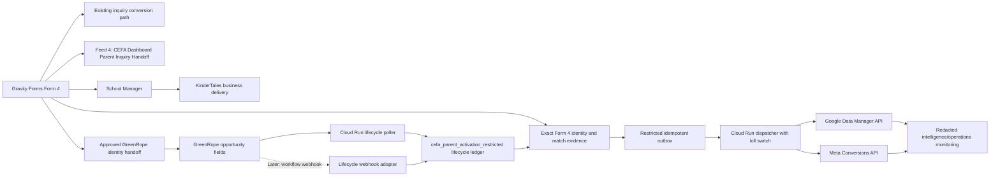

# CEFA Parent CRM Offline Conversion Immediate Full-Rollout Blueprint

**Status:** Approved source of truth for implementation
**Approved:** 2026-07-23
**Scope:** `cefa.ca` parent inquiries only
**Google Ads account:** `4159217891`
**Meta dataset:** `918227085392601`
**Restricted BigQuery dataset:** `marketing-api-488017.cefa_parent_activation_restricted`
**Roadmap anchor:** `docs/superpowers/plans/2026-06-12-bq-marketing-intelligence-blueprint.md`

## 1. Decision

Implement a CEFA-owned parent CRM offline-conversion system and move directly
to production delivery after these deterministic checks pass:

1. One controlled Form 4 inquiry proves exact identity reaches GreenRope while
   existing Form 4 and KinderTales delivery continue to work.
2. Every planned Google request passes `validateOnly=true`.
3. Every planned Meta CRM event appears in Meta Test Events.
4. Platform destination settings are read back and confirm that the new CRM
   outcomes are reporting-only signals.

There is no seven-day identity-coverage wait, no 14-day no-send period, and no
bounded calendar pilot. Eligibility is decided separately for each lifecycle
record. A safe record is sent immediately; a missing, ambiguous, conflicting,
expired, or otherwise unsafe record is quarantined without delaying other
records.

Immediate full rollout does not mean immediate bidding optimization. Existing
website inquiry conversions remain primary. Every CRM outcome introduced by
this rollout remains secondary/reporting and must not change campaign bidding.

## 2. Non-Negotiable Boundaries

- Gravity Forms Form `4` remains the authoritative parent inquiry source.
- Form 4 field `32.4` remains the canonical submission-scoped `event_id`.
- The Gravity Forms server entry ID remains the canonical form-entry identity.
- Form 4 fields `35-46` remain the saved attribution evidence.
- Form 4 field `32.1` remains the original school UUID used for school
  attribution.
- Existing `school_inquiry_submit`, Meta `Inquiry Submit`, and current Google
  website inquiry actions remain unchanged.
- School Manager's program, school, day, and KinderTales business-delivery
  behavior remain unchanged.
- The CEFA Conversion Tracking plugin remains responsible for attribution and
  event identity only. It does not become a CRM lifecycle or KinderTales
  delivery service.
- KinderTales delivery and GreenRope lifecycle processing are separate paths.
  Success or failure in the new GreenRope activation path must never interrupt
  KinderTales delivery.
- Franchise Canada, Franchise USA, Synuma, SiteZeus, Supabase, sGTM, campaign
  settings, budgets, bids, audiences, creative, and dashboard KPIs are outside
  this rollout.
- No current GreenRope state may be uploaded as a newly occurring conversion.
- No historical stage date may be inferred or backfilled.
- No CRM conversion value is assigned in v1.
- No Qualified Lead event is created until CEFA approves a business definition.
- GreenRope `post tour` remains explicitly labelled a candidate.
- GreenRope `enrollment (closed won)` is CRM evidence named `crm_closed_won`;
  it is not final KinderTales enrollment truth.
- No initial rollout object is created in a dashboard dataset. Redacted
  monitoring is available only in the marketing-intelligence/operations layer.

## 3. Verified Current State

Evidence in this section was read on 2026-07-23. It describes the starting
state; it is not evidence that production activation is complete.

### Existing Parent Inquiry Path

- Form 4 field `32.4` already contains the CEFA event ID.
- The CEFA Conversion Tracking plugin already persists and protects that event
  identity.
- Fields `35-46` preserve:
  - `35` `utm_source`
  - `36` `utm_medium`
  - `37` `utm_campaign`
  - `38` `utm_term`
  - `39` `utm_content`
  - `40` `gclid`
  - `41` `gbraid`
  - `42` `wbraid`
  - `43` `fbclid`
  - `44` `msclkid`
  - `45` `first_landing_page`
  - `46` `first_referrer`
- Form 4 feed `4` is `CEFA Dashboard Parent Inquiry Handoff` and sends to
  `cefa-brain.vercel.app`.
- School Manager independently sends the parent inquiry to KinderTales.
- No WordPress GreenRope writer was found in the live CEFA Conversion Tracking
  or School Manager implementation.

### GreenRope

- The GreenRope API exposes current opportunity fields, phases, and phase paths.
- The live opportunity field dictionary does not contain `cefa_event_id`.
- The live opportunity field dictionary does not contain
  `cefa_form_entry_id`.
- Current GreenRope extraction is current-state evidence, not a reliable
  timestamped transition history.
- Therefore exact Form 4-to-GreenRope identity is currently blocked until the
  two fields and a confirmed writer/handoff are added.

### Google And Meta

- The three planned Google CRM conversion actions do not exist.
- The three planned Meta CRM custom events/custom conversions do not exist.
- Google Data Manager API is not enabled in project `marketing-api-488017`.
- Existing parent inquiry conversions are live and are not part of this change.

### Repository Implementation

Implemented in the repository:

- pure identity, HMAC, normalization, stage, and eligibility primitives;
- read-only GreenRope dictionary and lifecycle polling adapters;
- permanently non-uploadable initial-baseline behavior;
- dedicated restricted BigQuery table contract;
- idempotent outbox and delivery-audit primitives;
- Google Data Manager and Meta CAPI payload adapters;
- automated parent-activation tests.

Still pending:

- exact GreenRope identity fields and the writer/handoff that populates them;
- controlled end-to-end identity test;
- restricted dataset deployment and IAM proof;
- Cloud Run poller/dispatcher packaging and deployment;
- dispatcher orchestration, diagnostics retrieval, and kill-switch wiring;
- Google Data Manager API enablement and destination validation;
- Google conversion-action creation and settings read-back;
- Meta Test Events validation and custom-conversion creation;
- production activation and post-activation monitoring.

## 4. Source Authority

| Concept | Authority | Rule |
|---|---|---|
| Confirmed parent inquiry | Gravity Forms Form 4 | A saved production entry is the inquiry record |
| Submission identity | Form 4 field `32.4` | Exact, immutable `cefa_event_id` |
| Form identity | Gravity Forms server entry ID | Populate `cefa_form_entry_id` server-side |
| School attribution | Form 4 field `32.1` | Use the original `school_uuid` |
| Website attribution | Form 4 fields `35-46` | Preserve exactly; do not overwrite business fields |
| KinderTales delivery | School Manager | Separate business-delivery path |
| Current CRM phase | GreenRope API | Current state only |
| Prospective CRM transition | CEFA lifecycle ledger | First state change observed after activation |
| Exact CRM transition | Future GreenRope workflow webhook | Use only a verified source timestamp |
| Final active student | KinderTales, outside v1 | GreenRope closed won must not be relabelled as final enrollment |
| Platform delivery result | Google/Meta diagnostics | Acceptance evidence, not CRM truth |

## 5. Target Architecture



The GreenRope bridge in this diagram is a required integration to be selected
and verified. It must not be represented as an existing WordPress writer.

## 6. Exact CRM Identity Contract

Create these GreenRope opportunity fields:

- `cefa_event_id`
- `cefa_form_entry_id`

Populate them as follows:

| Source | Destination | Requirement |
|---|---|---|
| Form 4 field `32.4` | GreenRope `cefa_event_id` | Exact value, no transformation |
| Gravity Forms entry `id` | GreenRope `cefa_form_entry_id` | Server-side value |
| Form 4 field `32.1` | Activation `school_uuid` | Preserve original Form 4 school |
| Form 4 fields `35-46` | Existing CRM attribution fields | Preserve current values and semantics |

A production CRM record is identity-eligible only when:

```text
cefa_event_id matches exactly one confirmed Form 4 submission
AND cefa_form_entry_id is present
AND cefa_form_entry_id belongs to that same submission
AND school_uuid comes from that Form 4 submission
```

The record is quarantined when either identity is missing, one identity
conflicts with the other, the event ID resolves to zero or multiple submissions,
or school attribution is ambiguous. This quarantine affects only that record.

Never use name, email, phone, school/date proximity, UTMs, or fuzzy matching as
a substitute for the exact identity join.

### Controlled Identity Test

Before platform activation, submit one controlled parent inquiry and prove:

1. Form 4 contains the generated event ID in `32.4`.
2. The GreenRope opportunity contains the exact same `cefa_event_id`.
3. GreenRope contains the matching `cefa_form_entry_id`.
4. School Manager delivers the inquiry to KinderTales successfully.
5. Existing Google and Meta inquiry conversions fire exactly once.
6. The test is labelled and excluded from business reporting.

One passing controlled test is the rollout gate. No aggregate identity-coverage
or calendar-duration gate applies.

## 7. Canonical Phase Contract

Only these positive stages are approved for platform activation:

| GreenRope outcome | Canonical stage | Activation |
|---|---|---|
| `tour scheduled` | `tour_scheduled` | Send immediately when record-eligible |
| `post tour` | `tour_completed_candidate` | Send immediately when record-eligible; retain candidate label |
| `enrollment (closed won)` | `crm_closed_won` | Send immediately when record-eligible; CRM reporting only |

Explicit non-send outcomes:

| Outcome | Handling |
|---|---|
| `nurturing` | Analysis only; not qualified |
| lost outcomes | Analysis only |
| missed outcomes | Analysis only |
| unmapped phase | Quarantine and alert |

No other phase is activation-approved in v1. A new or renamed GreenRope phase
must default to `unmapped`; it cannot become uploadable without a reviewed
contract update.

## 8. Prospective Lifecycle Rules

1. Capture one initial GreenRope state snapshot.
2. Mark every record in that snapshot `baseline_non_uploadable` permanently.
3. Start scheduled polling after the baseline commit succeeds.
4. Record only state changes first observed after activation.
5. Use the first observed transition time as `stage_occurred_at` with
   `timestamp_quality=poll_observed`.
6. Preserve each opportunity's lifecycle history for audit.
7. Collapse multiple school opportunities tied to the same Form 4 event into
   one platform conversion per canonical stage.
8. Upload only the first positive occurrence of each approved canonical stage
   for a Form 4 event.
9. A later GreenRope workflow webhook may improve timestamp quality, but it must
   write the same lifecycle contract and reuse the same idempotency keys.
10. Never infer historical transitions from the initial or current snapshot.

## 9. Restricted Data Contract

Use only:

```text
marketing-api-488017.cefa_parent_activation_restricted
```

Do not reuse the shared `cefa_restricted` dataset. Do not create a dashboard
dataset object during the initial rollout.

Required restricted tables:

- `parent_crm_lifecycle_state_snapshot`
- `parent_crm_lifecycle_event`
- `parent_crm_match_key`
- `parent_conversion_outbox`
- `parent_conversion_delivery_attempt`

The detailed table contract is in:

`docs/20-bigquery/parent-crm-offline-conversion-data-contract.md`

### Privacy And Retention

- Derive lead, opportunity, lifecycle, parent-stage, and transaction identities
  with an HMAC secret stored in Secret Manager.
- Never upload or persist the existing unsalted CRM dedupe hash as a platform
  identifier.
- Retain raw `gclid`, `gbraid`, `wbraid`, `fbc`, and `fbp` only in restricted
  storage and for no more than 100 days.
- Normalize and SHA-256 hash email/phone transiently in Cloud Run memory.
- Do not store raw names, email, phone, child details, addresses, notes, IP
  addresses, or raw CRM/platform payloads in marketing tables or logs.
- Validate pre-hashed identifiers as lowercase 64-character hexadecimal values
  before persistence or dispatch.
- Sanitize platform error text before storing diagnostics.
- Grant access only to the activation runtime and designated administrators.
- Reporting identities receive only aggregate, redacted operational metrics.

## 10. Record-Level Eligibility

An outbox row is send-eligible only when:

```text
scope is parent Form 4
AND source is not the initial baseline
AND exact cefa_event_id resolves to one Form 4 submission
AND cefa_form_entry_id agrees with that submission
AND canonical stage is approved
AND event is the first approved occurrence for that parent and stage
AND multi-school records have collapsed to one parent-stage transaction
AND timestamp is prospective and permitted
AND platform identifier evidence is real and within age limits
AND inherited consent/eligibility policy permits the event
AND transaction ID has not already been accepted
AND dispatcher kill switch is off
```

Quarantine reasons include:

- `missing_event_identity`
- `missing_form_entry_identity`
- `conflicting_identity`
- `ambiguous_identity`
- `initial_baseline`
- `unmapped_stage`
- `non_activation_stage`
- `duplicate_parent_stage`
- `missing_platform_match_key`
- `expired_click_identifier`
- `expired_user_identifier`
- `expired_meta_event`
- `consent_not_eligible`
- `invalid_identifier_format`
- `destination_not_ready`

Every quarantine reason must be visible, countable, and recoverable where the
underlying evidence can later be corrected.

## 11. Idempotency

Use HMAC-derived identifiers that never expose raw CRM or form identities.

Lifecycle audit identity:

```text
HMAC(source account | opportunity identity | canonical stage | stage sequence)
```

Platform parent-stage transaction identity:

```text
HMAC(
  source account
  | form4_event identity scope
  | form4_event identity
  | canonical stage
  | approved occurrence number
)
```

Outbox identity:

```text
HMAC(platform | destination action | parent-stage transaction ID)
```

The outbox must use atomic leasing, lease-owner checks, retry scheduling, and an
immutable accepted lock. Poll retries, webhook retries, Cloud Run retries, and
platform retries must resolve to the same transaction identity.

## 12. Google Activation Contract

Create these Google Ads `UPLOAD_CLICKS` conversion actions:

- `CEFA | Parent | CRM Tour Scheduled | GOOGLE`
- `CEFA | Parent | CRM Tour Completed Candidate | GOOGLE`
- `CEFA | Parent | CRM Closed Won | GOOGLE`

Required settings:

- account `4159217891`;
- secondary;
- count `ONE`;
- no monetary value;
- excluded from account-default goals;
- not used by campaign bidding.

Delivery rules:

- Enable Google Data Manager API in project `marketing-api-488017`.
- Store and validate the bare numeric conversion-action ID, not a Google Ads
  resource path.
- Prefer genuine `gclid`, `gbraid`, or `wbraid`.
- Use normalized hashed email/phone only when eligible for enhanced lead
  matching.
- Enforce the applicable click-ID and enhanced-lead age windows before the
  adapter is called.
- Use the HMAC parent-stage ID as `transactionId`.
- Run `validateOnly=true` for every destination before the first production
  request.
- Store the returned request ID and retrieve delivery diagnostics.
- Read back conversion-action settings after creation and after production
  activation.
- Any action that is primary or included in account-default goals blocks
  production delivery.

Do not modify existing Google inquiry actions, campaign goals, or bidding.

## 13. Meta Activation Contract

Send these Meta CAPI server events to dataset `918227085392601`:

- `CEFA_CRM_TourScheduled`
- `CEFA_CRM_TourCompletedCandidate`
- `CEFA_CRM_ClosedWon`

Create matching Meta custom conversions for reporting. Do not choose these
custom conversions as ad-set optimization events.

Delivery rules:

- use the HMAC parent-stage transaction ID as `event_id`;
- use HMAC lead identity as `external_id` only as a stable CEFA identifier;
- require at least one real Meta match path: eligible hashed email/phone or
  genuinely captured `fbc`/`fbp`;
- never fabricate Meta cookies or click timestamps;
- use `action_source=system_generated`;
- include canonical stage and original Form 4 school UUID in `custom_data`;
- block events outside Meta's permitted event-age window;
- prove all three events in Meta Test Events before production;
- never emit another `Inquiry Submit` from this service.

Meta does not have Google's primary/secondary action setting. Reporting-only is
enforced by campaign/ad-set configuration: the new custom conversions must not
be selected for optimization.

## 14. Runtime And Deployment

Deploy two independent Cloud Run jobs:

1. Parent GreenRope lifecycle poller
2. Parent offline-conversion dispatcher

They must not be coupled to School Manager, Form 4 submission handling,
KinderTales delivery, the existing conversion tag path, or the school marketing
refresh job.

Required runtime modes:

- `disabled`
- `validate_only`
- `meta_test`
- `secondary_production`

Required controls:

- independent Google and Meta send switches;
- global dispatcher kill switch;
- maximum bounded batch size;
- atomic leases;
- retryable/permanent error classification;
- sanitized logs;
- Secret Manager credentials;
- Python runtime pinned to the tested supported version;
- separate scheduler invocations and run manifests.

Turning off the dispatcher must stop new sends without disabling polling,
Form 4, existing inquiry conversions, or KinderTales.

## 15. Immediate Rollout Sequence

### Phase A: Finish Safe Infrastructure

1. Reconcile the dirty repository without discarding unrelated work.
2. Commit this blueprint as the implementation source of truth.
3. Finish and test dispatcher orchestration and runtime packaging.
4. Create `cefa_parent_activation_restricted` with restricted IAM.
5. Apply the table contract and prove dashboard/reporting identities cannot read
   restricted match keys.
6. Deploy poller and dispatcher with all send switches disabled.

### Phase B: Establish Identity

1. Create GreenRope `cefa_event_id` and `cefa_form_entry_id`.
2. Implement the approved Form 4-to-GreenRope writer/handoff.
3. Preserve fields `35-46` and the existing KinderTales path.
4. Run the single controlled inquiry.
5. Pass every controlled-test assertion in Section 6.

### Phase C: Configure Platforms

1. Enable Google Data Manager API.
2. Create the three Google actions.
3. Read back and prove all three are secondary and excluded from bidding goals.
4. Run `validateOnly=true` successfully for all three destinations.
5. Send all three Meta event types with a Test Events code.
6. Confirm all three appear in Meta Test Events.
7. Create the three Meta reporting custom conversions.
8. Confirm no campaign or ad set optimizes to them.

### Phase D: Activate Production

1. Take one GreenRope initial snapshot.
2. Commit every initial row as `baseline_non_uploadable`.
3. Enable prospective polling.
4. Enable the outbox and dispatcher.
5. Set both platforms to `secondary_production`.
6. Send every eligible new prospective stage immediately.
7. Leave incomplete records quarantined.
8. Retrieve Google diagnostics and Meta delivery results.
9. Verify existing inquiry tracking, campaign goals, bidding, Form 4, School
   Manager, and KinderTales remain unchanged.

No additional calendar wait or pilot approval occurs between Phases C and D.

## 16. Automated Acceptance Tests

Required tests:

- exact Form 4-to-GreenRope identity;
- missing/conflicting/ambiguous identity quarantine;
- canonical stage mapping;
- non-send stage blocking;
- initial-baseline non-uploadability;
- HMAC stability and uniqueness;
- platform transaction identity independent of school opportunity count;
- multi-school deduplication;
- first-positive-stage enforcement;
- identifier format and age limits;
- email/phone normalization;
- consent/eligibility fail-closed behavior;
- atomic leasing and accepted-lock behavior;
- retry idempotency;
- prohibited PII column, payload, and log scanning;
- dispatcher kill switch;
- restricted dataset IAM;
- direct outbox-to-adapter contract compatibility.

## 17. End-To-End Acceptance

Production rollout is accepted only when:

- the controlled Form 4 identity test passes;
- KinderTales delivery succeeds during the controlled test;
- existing inquiry events fire exactly once;
- Google `validateOnly=true` passes for all three destinations;
- Meta Test Events receives all three CRM events;
- Google action read-back confirms secondary, `ONE`, no value, and excluded
  from account-default goals;
- eligible prospective stages appear in both platforms;
- duplicate accepted transaction IDs equal zero;
- multi-school conversion inflation equals zero;
- baseline/current-state GreenRope records uploaded equals zero;
- existing website inquiry tracking remains unchanged;
- permanent platform failures remain below 1% after retry;
- raw PII is absent from marketing BigQuery, logs, and diagnostics;
- every blocked record has a visible reason;
- the kill switch stops sends without affecting Form 4 or KinderTales.

## 18. Immediate Stop Conditions

Disable the dispatcher immediately when any of these occur:

- duplicate accepted parent-stage transaction IDs;
- raw PII in a table, log, request diagnostic, or alert;
- current inquiry conversion interference;
- Form 4 or KinderTales delivery regression;
- an initial-baseline record reaches a platform;
- an incorrect stage mapping reaches a platform;
- a Google action becomes primary or biddable;
- a Meta CRM custom conversion is selected for optimization;
- school opportunity fan-out inflates platform conversions.

Preserve the lifecycle ledger, outbox, and delivery history for diagnosis. Do
not delete evidence as part of rollback.

## 19. Monitoring

Initial monitoring belongs in the marketing-intelligence/operations layer only.
It may expose aggregate counts for:

- prospective lifecycle events by canonical stage;
- eligible, quarantined, queued, accepted, retryable, and permanent-failure
  counts;
- quarantine reasons;
- match-path coverage by platform;
- duplicate transaction IDs;
- baseline upload attempts;
- delivery latency and diagnostics;
- platform acceptance rates;
- existing inquiry continuity checks.

Do not expose click IDs, contact hashes, HMAC identities, event IDs, form entry
IDs, raw error text, or platform payloads to reporting consumers.

No dashboard dataset view or dashboard KPI is part of the initial rollout.

## 20. Implementation Status

| Work item | Status on 2026-07-23 | Activation implication |
|---|---|---|
| Approved immediate rollout blueprint | Implemented by this document | Source-of-truth decision recorded |
| Pure identity/lifecycle primitives | Implemented in repository | Ready for integration testing |
| Restricted table contract | Implemented in repository | Not yet deployed or IAM-proven |
| GreenRope read-only adapter/poller primitives | Implemented in repository | Correctly blocked on missing identity fields |
| Google/Meta payload adapters | Implemented and safety-hardened | Live destination validation pending |
| GreenRope identity fields | Blocked: absent in live field dictionary | Production record eligibility cannot pass |
| GreenRope identity writer/handoff | Blocked: no WordPress writer found | Must be implemented and controlled-tested |
| KinderTales separation | Verified architectural requirement | Must remain untouched |
| Google CRM actions | Pending: do not exist | Create and read back |
| Google Data Manager API | Pending: not enabled | Enable before validation |
| Meta CRM custom events/conversions | Pending: do not exist | Test then create reporting conversions |
| Dedicated restricted dataset | Pending deployment | Do not use shared `cefa_restricted` |
| Dispatcher/runtime deployment | Pending | Keep send switches disabled until gates pass |
| Production activation | Blocked on identity and platform tests | Activate immediately after deterministic gates |

## 21. Definition Of Done

The implementation is done when:

1. Every new eligible prospective Form 4 CRM outcome can be joined exactly,
   deduplicated, dispatched, diagnosed, and recovered.
2. Ineligible records remain quarantined without delaying eligible records.
3. All three approved stages are delivered to both platforms.
4. Google actions remain secondary and non-biddable.
5. Meta CRM custom conversions remain reporting-only.
6. No historical/current-state GreenRope record is uploaded.
7. Existing parent inquiry conversions, Form 4, School Manager, and KinderTales
   remain unchanged.
8. Restricted data and PII controls pass.
9. The kill switch is proven.
10. The implementation report records deployment IDs, validation evidence,
    platform action IDs, test results, and the activation timestamp.

## 22. References

- [Google Data Manager API send events](https://developers.google.com/data-manager/api/devguides/events/send-events)
- [Google Data Manager API diagnostics](https://developers.google.com/data-manager/api/devguides/diagnostics)
- [Meta Conversions API](https://www.facebook.com/business/help/AboutConversionsAPI)
- `docs/20-bigquery/parent-crm-offline-conversion-data-contract.md`
- `docs/10-conversion-tracking/parent-crm-offline-conversion-implementation-report.md`
- `data/reference/cefa-parent-crm-field-contract-v1.csv`
- `data/reference/cefa-parent-crm-phase-contract-v1.csv`
